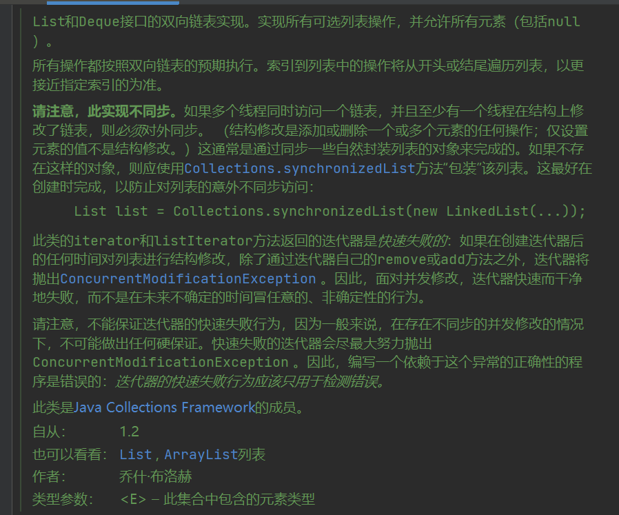
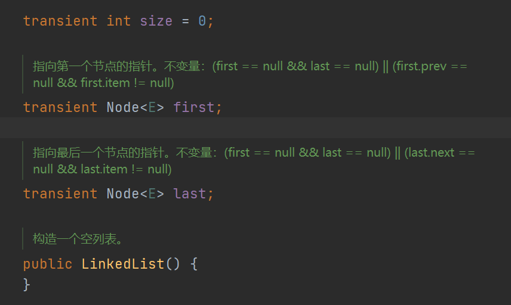
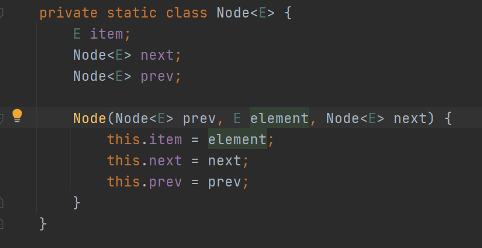
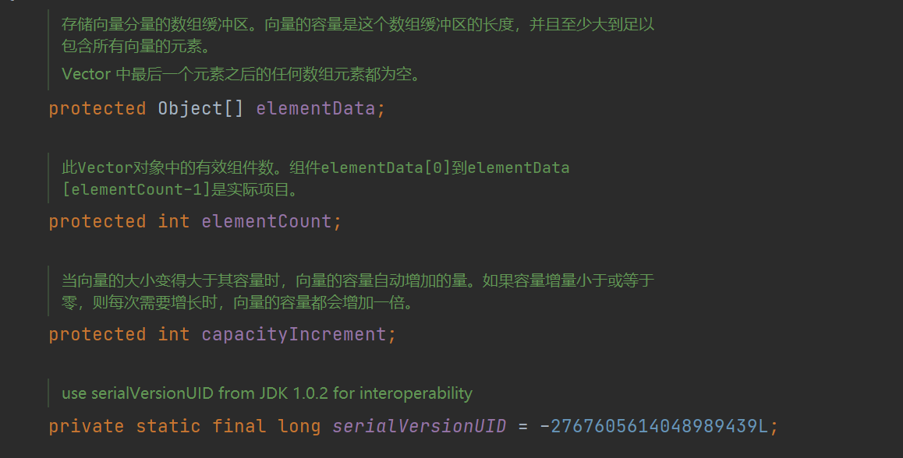
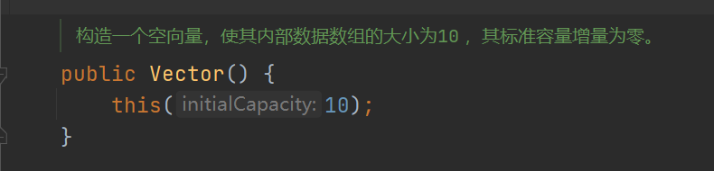
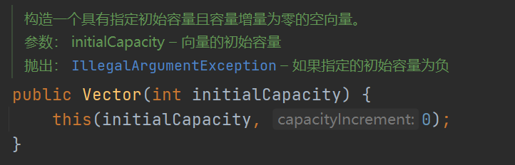
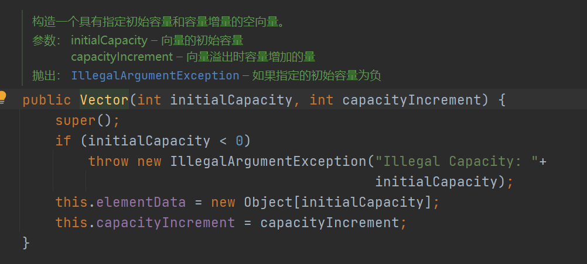
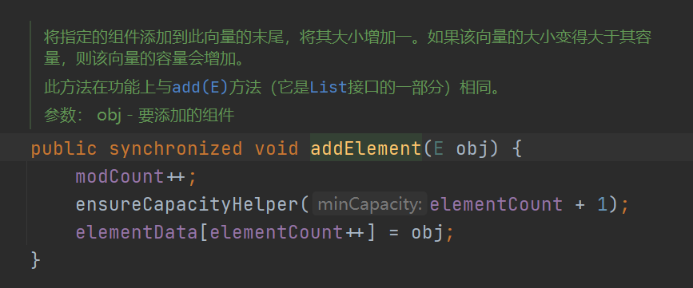
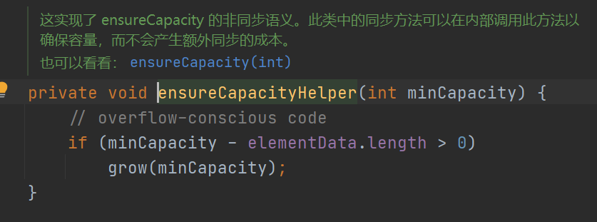
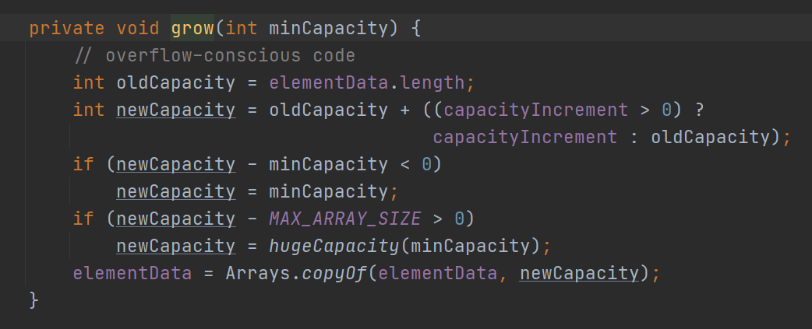

# 集合简介


## 1、什么是集合

java集合框架有很多，如list,set,map

所有的集合类都在java.util包下面

主要是有两个接口Collection和Map


## 2、Collection和Map的主要区别

collection下的都是一次存储一个值

Map是每次存储一个<k,v>键值对


## 3、集合和数组的区别，以及使用结合的好处

区别：

1. 从可以使用长度来说：集合可以自增长，不需要提前知道所要存储数据的长度，数组是固定长度，所以需要提前知道要存储数据的长度

2. 从存储数据类型角度看：数组可以存储8种基本数据类型，同时也可以存储引用数据类型，然而集合只能存储引用数据类型，如：不能存储int,double,boolean，只能通过存储Integer,Double,Boolean类型的数据，在存储的时候，通过编译时有类型的擦除，最后都会变成Object类型 

   ```java
   (Object)1 ->(Object)Integer.valueOf(1)
   ```

3. 数组存储的元素必须是要同一个数据类，集合存储的对象可以是不同数据类型的

好处：

1. 容量自增长；
2. 提供了高性能的数据结构和算法，使编码更轻松，提高了程序速度和质量；
3. 允许不同 API 之间的互操作，API之间可以来回传递集合；
4. 可以方便地扩展或改写集合，提高代码复用性和可操作性。
5. 通过使用JDK自带的集合类，可以降低代码维护和学习新API成本。

## 4、集合的特点

- 对象封装数据，对象多了也需要存储。集合用于存储对象。
- 对象的个数确定可以使用数组，对象的个数不确定的可以用集合。因为集合是可变长度的。


# 5、集合分类


## 5.1 Collections接口	


### 5.1.1 list

list的主要实现类有：ArrayList,LinkedList,Vector

#### 5.1.1.1 ArrayList


底层实现：由数组实现，由Object[]数组实现的，源码如下：


源码具体参数如下：


1. elementData是用来存储存进入ArrayList元素的Object数组(当使用ArrayList的add方法的时候)


2. 当创建ArrayList对象的时候，使用空参构造的构造方法或者使用有参构造的参数initialCapacity为零的时候用来赋值给elementData的，具体如下：


3. ArrayList 底层数组默认初始化容量为 10 ，jdk8使用的是DEFAULT_CAPACITY来设置默认初始化的容量

4. 当ArrayList的元素超过了容量的时候会增容

   当使用add方法的时候,先确保容量够不够

   

   如果判断了超出容量的话，就会触发容量自增

   

   如上图所示

   新的容量=旧的容量+（旧的容量）/2 = 1.5旧容量

   ```java
   newCapacity=oldCapacity + (oldCapacity>>1)
   ```

   容量自增为原来的1.5倍

5. **ArrayList** **特点：**

   **	优点：**

   1. 向 ArrayList 末尾添加元素（add() ⽅法）时，效率较⾼ ，因为不用移动其他元素

   2. 查询效率⾼ ，因为可以根据数组下标直接访问

   **缺点：**

   1. 删除元素的时候和在某一个位置插入元素的时候效率会比较低，因为删除的时候，这个元素往后的都要全部往前移动一位，插入元素的时候，插入的位置的元素及其以后的都要往后退后一位，效率就变低，性能就会比较低
   2. 数组无法存储大容量的数据，因为数组的存储是连续的一段内存空间，在实际情况中无法找到连续的一段内存空间

6. **总结**

   不同步，非线程安全，效率高，支持随机访问

   源代码文档当中

   ```xml
   请注意，此实现不同步。如果多个线程同时访问一个ArrayList实例，并且至少有一个线程在结构上修改了列表，则必须在外部进行同步。 （结构修改是添加或删除一个或多个元素，或显式调整后备数组大小的任何操作；仅设置元素的值不是结构修改。）这通常通过同步一些自然封装的对象来完成列表。如果不存在这样的对象，则应使用Collections.synchronizedList方法“包装”该列表。这最好在创建时完成，以防止对列表的意外不同步访问
   ```

   1. **不同步与不安全**：

   举例

    比如一个 ArrayList 类，在添加一个元素的时候，它可能会有两步来完成：1. 在 Items[Size] 的位置存放此元素；2. 增大 Size 的值。

    　在单线程运行的情况下，如果 Size = 0，添加一个元素后，此元素在位置 0，而且 Size=1；

    　而如果是在多线程情况下，比如有两个线程，线程 A 先将元素存放在位置 0。但是此时 CPU 调度线程A暂停，线程 B  得到运行的机会。线程B也向此 ArrayList 添加元素，因为此时 Size 仍然等于 0  （注意哦，我们假设的是添加一个元素是要两个步骤哦，而线程A仅仅完成了步骤1），所以线程B也将元素存放在位置0。然后线程A和线程B都继续运行，都增加 Size 的值。

    　那好，现在我们来看看 ArrayList 的情况，元素实际上只有一个，存放在位置 0，而 Size 却等于 2。这就是“线程不安全”了。

​	**注：因为不同步所以不安全**

​	**那么如何让ArrayList进行同步呢？**

```
Collections.synchronizedList //可以使用Collections类的方法
```

​	2.**效率高，随机访问**：

​		因为底层是Object[]数组，所以通过数组下标可以支持随机访问


#### 5.1.1.2 LinkedList


源码文档：



##### linkedList的底层

linkedList的底层实现是由双向链表



如上图所示：

该双向链表由两个指针：指向第一个节点和最后一个节点的指针，链表长度的变量size



如上图所示：Node是实现双向链表的节点,有前节点和后节点

##### 注：因为底层是双向链表实现的，所以没有增容的机制的，因为链表本来就是长度不固定的

##### 优点

1. 增加和删除效率高，删除也是需要遍历，但是删除完后不需要移动其他元素，相比较运行的性能较高
2. 查询的效率低，因为链表的节点在内存当中存储不是连续的，所以要一个一个的遍历进行查询，造成了效率低
3. 以下为增加元素的源码

```java

    将指定元素附加到此列表的末尾。
    此方法等效于addLast 。
    参数：
    e – 要附加到此列表的元素
    回报：true （由Collection.add指定）
    
    public boolean add(E e) {
        linkLast(e);
        return true;
    }
    
    void linkLast(E e) {
        final Node<E> l = last;
        final Node<E> newNode = new Node<>(l, e, null);
        last = newNode;
        if (l == null)
            first = newNode;
        else
            l.next = newNode;
        size++;
        modCount++;
    }
    
    
```

4. 以下为删除的源码：

   ```
   从此列表中删除第一次出现的指定元素（如果存在）。如果此列表不包含该元素，则它不变。更正式地说，删除具有最低索引i的元素，使得(o==null ? get(i)==null : o.equals(get(i))) （如果存在这样的元素）。如果此列表包含指定的元素（或等效地，如果此列表因调用而更改），则返回true 。
   参数：o – 要从此列表中删除的元素（如果存在）
   回报：如果此列表包含指定元素，则为true
   
   public boolean remove(Object o) {
           if (o == null) {
               for (Node<E> x = first; x != null; x = x.next) {
                   if (x.item == null) {
                       unlink(x);
                       return true;
                   }
               }
           } else {
               for (Node<E> x = first; x != null; x = x.next) {
                   if (o.equals(x.item)) {
                       unlink(x);
                       return true;
                   }
               }
           }
           return false;
       }
       //以下是取消非空节点的链接，还有unlinkLast,unlinkFirst原理差不多
       E unlink(Node<E> x) {
           // assert x != null;
           final E element = x.item;
           final Node<E> next = x.next;
           final Node<E> prev = x.prev;
   
           if (prev == null) {
               first = next;
           } else {
               prev.next = next;
               x.prev = null;
           }
   
           if (next == null) {
               last = prev;
           } else {
               next.prev = prev;
               x.next = null;
           }
   
           x.item = null;
           size--;
           modCount++;
           return element;
       }
   ```

   5. 以下是清空LinkedList的源码

      ```
      //全部节点的属性赋值为空
      public void clear() {
              // Clearing all of the links between nodes is "unnecessary", but:
              // - helps a generational GC if the discarded nodes inhabit
              //   more than one generation
              // - is sure to free memory even if there is a reachable Iterator
              for (Node<E> x = first; x != null; ) {
                  Node<E> next = x.next;
                  x.item = null;
                  x.next = null;
                  x.prev = null;
                  x = next;
              }
              first = last = null;
              size = 0;
              modCount++;
          }
      ```

##### 总结

​		不同步，线程不安全，不支持随机访问，但是增删操作效率高，不适合查询

线程不同步不安全例子：

```java
void linkLast(E e) {
        final Node<E> l = last;
        final Node<E> newNode = new Node<>(l, e, null);
        last = newNode;
        if (l == null)
            first = newNode;
        else
            l.next = newNode;
        size++;
        modCount++;
    }

```


当两个线程并行运行时候同时向第四个节点处尾插加入第五个节点，第一个线程拿到第四个节点的引用地址last赋值给l，并创建新的节点，将新节点的prev指向第四个节点。此时线程阻塞，第二个线程执行，并成功添加第五个节点，然后第一个线程继续执行，将last赋值为刚刚新建的节点，并将l（第四个节点）的next域指向新节点，此时链表里面共五个点，第二个线程创建的节点会被第一个线程创建的节点覆盖，不安全。

#### 5.1.1.3 Vector


源码代码如下：

##### Vector的属性分析



**Vector**的属性解析：

**elementData**：用来存储数据的

**elementCount**：是Vector向量当前的容量

**capacityIncrement**：是Vector向量每次扩容的大小


##### **Vector底层的实现**

​		Vector的底层实现是：由Object[]数组实现的

```java
protected Object[] elementData;
```







如上图所示：

当使用Vector的空参构造实例化对象的时候，会使用默认的**容量（10）**进行对象实例化，然后调用有参构造方法 **Vector(int initialCapacity)** ，**Vector(int initialCapacity)** 方法再调用有参构造方法**Vector(int initialCapacity, int capacityIncrement)**，指定容量增量为0，初始容量为10的空向量Vector。


##### **Vector插入一个元素的过程**

		1.  首先线进入判断容量大小
		1.  判断插入一个元素的容量是否超过数组缓冲区的长度



3. 判断容量不够会进入扩容的机制



如上图所示：

```java
int newCapacity = oldCapacity + ((capacityIncrement > 0) ?
                                         capacityIncrement : oldCapacity);
```

先判断自增容量是否大于0，如果大于0就是选择自定义的自增容量

```
int newCapacity = oldCapacity + capacityIncrement;
```

否则使用默认的oldCapacity,容量为原来的2倍

```java
int newCapacity = oldCapacity + oldCapacity;
```

##### **Vector的特点**

1. 增加和删除效率低，但是增加和删除完后需要移动其他元素，造成了性能低
2. 查询的效率高，因为存在数组下标，支持随机访问

##### 总结

同步，线程安全，查询效率高，但不推荐使用

线程安全是因为方法里使用了**synchronized**

### 5.1.2 set


#### 5.1.2.1 HashSet


#### 5.1.2.2 TreeSet


#### 5.1.2.3 LinkedHashSet


## 5.2 Map接口


