# 集合简介


## 1、什么是集合

java集合框架有很多，如list,set,map

所有的集合类都在java.util包下面

主要是有两个接口Collection和Map


## 2、Collection和Map的主要区别

collection下的都是一次存储一个值

Map是每次存储一个<k,v>键值对


## 3、集合和数组的区别，以及使用结合的好处

区别：

1. 从可以使用长度来说：集合可以自增长，不需要提前知道所要存储数据的长度，数组是固定长度，所以需要提前知道要存储数据的长度

2. 从存储数据类型角度看：数组可以存储8种基本数据类型，同时也可以存储引用数据类型，然而集合只能存储引用数据类型，如：不能存储int,double,boolean，只能通过存储Integer,Double,Boolean类型的数据，在存储的时候，通过编译时有类型的擦除，最后都会变成Object类型 

   ```java
   (Object)1 ->(Object)Integer.valueOf(1)
   ```

3. 数组存储的元素必须是要同一个数据类，集合存储的对象可以是不同数据类型的

好处：

1. 容量自增长；
2. 提供了高性能的数据结构和算法，使编码更轻松，提高了程序速度和质量；
3. 允许不同 API 之间的互操作，API之间可以来回传递集合；
4. 可以方便地扩展或改写集合，提高代码复用性和可操作性。
5. 通过使用JDK自带的集合类，可以降低代码维护和学习新API成本。

## 4、集合的特点

- 对象封装数据，对象多了也需要存储。集合用于存储对象。
- 对象的个数确定可以使用数组，对象的个数不确定的可以用集合。因为集合是可变长度的。


# 5、集合分类


## 5.1 Collections接口	

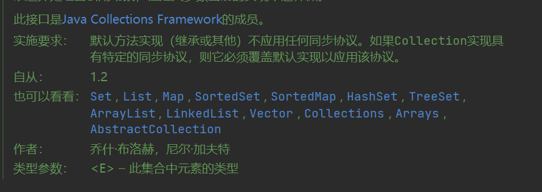


### 5.1.1 list

list的主要实现类有：ArrayList,LinkedList,Vector

#### 5.1.1.1 ArrayList

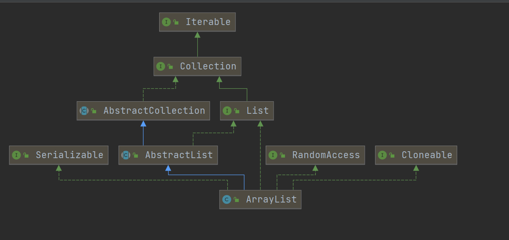

底层实现：由数组实现，由Object[]数组实现的，源码如下：

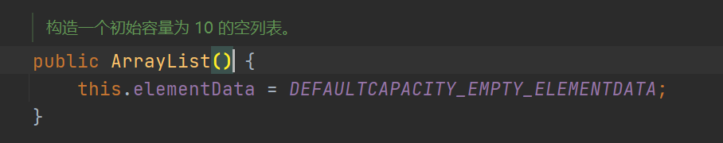

源码具体参数如下：

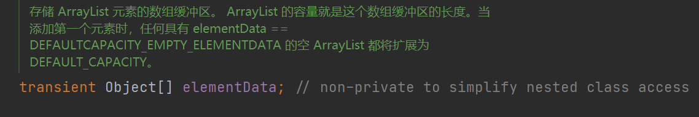

1. elementData是用来存储存进入ArrayList元素的Object数组(当使用ArrayList的add方法的时候)

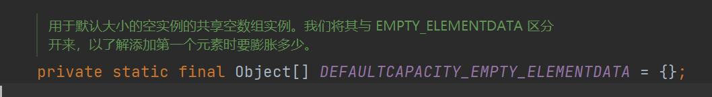

2. 当创建ArrayList对象的时候，使用空参构造的构造方法或者使用有参构造的参数initialCapacity为零的时候用来赋值给elementData的，具体如下：

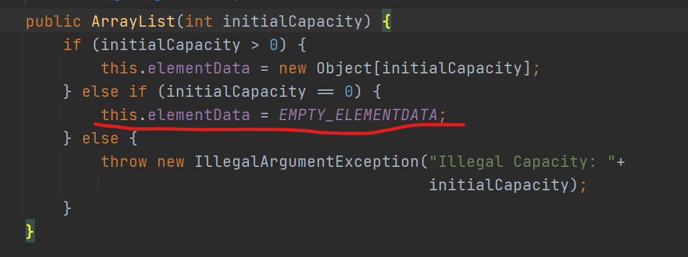

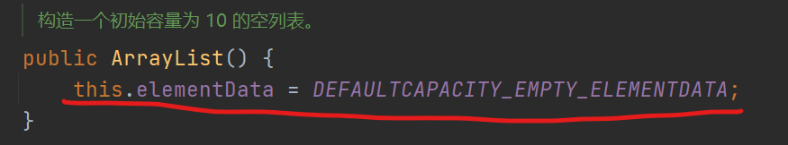


3. ArrayList 底层数组默认初始化容量为 10 ，jdk8使用的是DEFAULT_CAPACITY来设置默认初始化的容量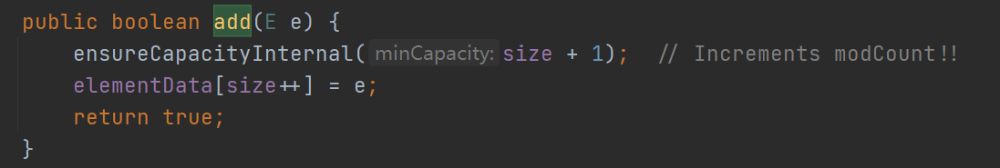

4. 当ArrayList的元素超过了容量的时候会增容

   当使用add方法的时候,先确保容量够不够

   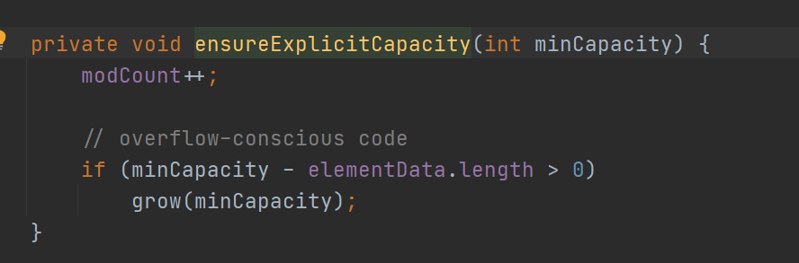

   如果判断了超出容量的话，就会触发容量自增

   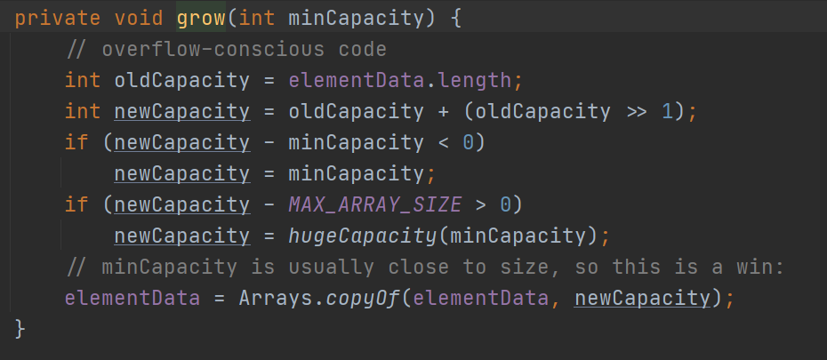

   如上图所示

   新的容量=旧的容量+（旧的容量）/2 = 1.5旧容量

   ```java
   newCapacity=oldCapacity + (oldCapacity>>1)
   ```

   容量自增为原来的1.5倍

5. **ArrayList** **特点：**

   **优点：**

   1. 向 ArrayList 末尾添加元素（add() ⽅法）时，效率较⾼ ，因为不用移动其他元素

   2. 查询效率⾼ ，因为可以根据数组下标直接访问

   **缺点：**

   1. 删除元素的时候和在某一个位置插入元素的时候效率会比较低，因为删除的时候，这个元素往后的都要全部往前移动一位，插入元素的时候，插入的位置的元素及其以后的都要往后退后一位，效率就变低，性能就会比较低
   2. 数组无法存储大容量的数据，因为数组的存储是连续的一段内存空间，在实际情况中无法找到连续的一段内存空间

6. **总结**

   不同步，非线程安全，效率高，支持随机访问

   源代码文档当中

   ```xml
   请注意，此实现不同步。如果多个线程同时访问一个ArrayList实例，并且至少有一个线程在结构上修改了列表，则必须在外部进行同步。 （结构修改是添加或删除一个或多个元素，或显式调整后备数组大小的任何操作；仅设置元素的值不是结构修改。）这通常通过同步一些自然封装的对象来完成列表。如果不存在这样的对象，则应使用Collections.synchronizedList方法“包装”该列表。这最好在创建时完成，以防止对列表的意外不同步访问
   ```

   1. **不同步与不安全**：

   举例

    比如一个 ArrayList 类，在添加一个元素的时候，它可能会有两步来完成：1. 在 Items[Size] 的位置存放此元素；2. 增大 Size 的值。

    　在单线程运行的情况下，如果 Size = 0，添加一个元素后，此元素在位置 0，而且 Size=1；

    　而如果是在多线程情况下，比如有两个线程，线程 A 先将元素存放在位置 0。但是此时 CPU 调度线程A暂停，线程 B  得到运行的机会。线程B也向此 ArrayList 添加元素，因为此时 Size 仍然等于 0  （注意哦，我们假设的是添加一个元素是要两个步骤哦，而线程A仅仅完成了步骤1），所以线程B也将元素存放在位置0。然后线程A和线程B都继续运行，都增加 Size 的值。

    　那好，现在我们来看看 ArrayList 的情况，元素实际上只有一个，存放在位置 0，而 Size 却等于 2。这就是“线程不安全”了。

​	**注：因为不同步所以不安全**

​	**那么如何让ArrayList进行同步呢？**

```
Collections.synchronizedList //可以使用Collections类的方法
```

​	2.**效率高，随机访问**：

​		因为底层是Object[]数组，所以通过数组下标可以支持随机访问


#### 5.1.1.2 LinkedList


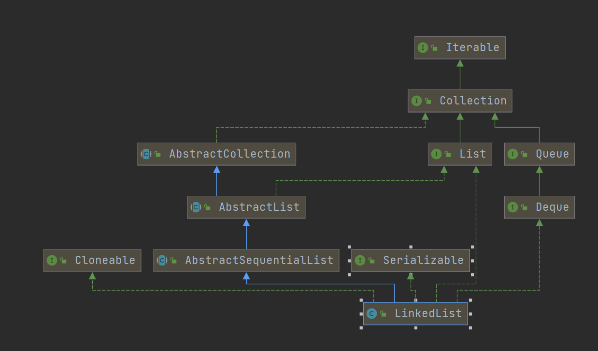

#### 5.1.1.3 Vector

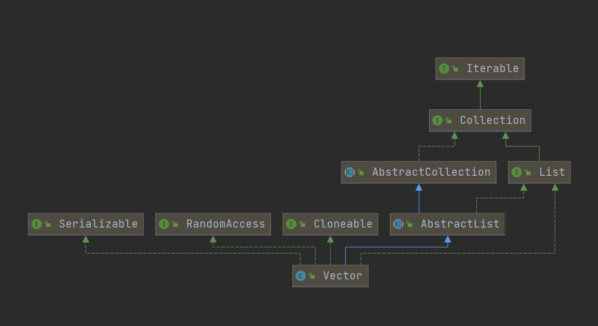

### 5.1.2 set


#### 5.1.2.1 HashSet


#### 5.1.2.2 TreeSet


#### 5.1.2.3 LinkedHashSet


## 5.2 Map接口


